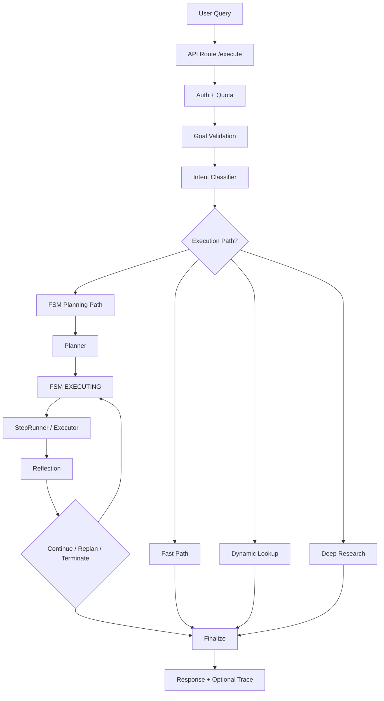

# TAOS Full Architecture

This document is the repo-level reference for how TAOS works today.

## 1. Core Purpose

TAOS solves the gap between "LLM answer generation" and "controlled agent execution". A normal chatbot can answer, but it often cannot reliably:
- choose the right execution path,
- use tools consistently,
- recover from weak evidence,
- schedule future work,
- explain how it reached its output.

TAOS is for teams building a trustworthy AI backend: agent chat, research, task automation, workflow execution, and notification delivery under one runtime.

What TAOS can do today end to end:
- accept a user query through API,
- classify intent/domain,
- fast-path simple requests,
- run full FSM-controlled execution for complex requests,
- execute typed steps (`tool`, `reason`, `dag_exec`),
- use micro-DAGs for structured research,
- create persistent tasks from chat,
- run scheduled tasks,
- send email and push notifications,
- stream progress with SSE,
- return sanitized execution trace data,
- persist task/user/execution artifacts through the storage layer.

Key entrypoints:
- [app main](/D:/agent/taos/apps/api/main.py)
- [agent route](/D:/agent/taos/apps/api/routes/agent.py)
- [orchestration engine](/D:/agent/taos/orchestration/engine.py)

## 2. High-Level Runtime Flow

From query to answer, the main runtime flow is:

1. API receives the request through `POST /execute` in [agent route](/D:/agent/taos/apps/api/routes/agent.py).
2. Auth/user scope is resolved and quota is checked.
3. `OrchestrationEngine.run()` starts in [engine](/D:/agent/taos/orchestration/engine.py).
4. Goal validation runs.
5. Semantic classification decides `intent`, `domain`, follow-up status, and suggested mode.
6. Engine checks:
   - cache hit,
   - fast path,
   - dynamic live lookup,
   - deep research intercept,
   - or full FSM planning.
7. If full FSM path is used:
   - controller initializes state,
   - FSM enters `PLANNING`,
   - planner emits typed steps,
   - FSM enters `EXECUTING`,
   - executor runs one step,
   - FSM enters `REFLECTING`,
   - reflector/confidence logic decides continue, replan, or terminate.
8. Finalization formats the answer, runs self-evaluation, applies safe fallbacks if needed, updates memory/persistence, and optionally attaches execution trace.

High-level control shape:

## 3. Planner

Planner behavior is split between classifier-driven routing in the engine and step generation in the planner itself.

The engine decides whether planning is needed at all:
- direct/simple response: fast path or tiered bypass,
- tool-assisted live lookup: freshness-sensitive simple queries,
- deep research pipeline: research/news/current-status style requests,
- full planner path: all other complex cases.

When the planner is used, it emits `PlanObject` and `PlanStep` from [state schema](/D:/agent/taos/core/state/state_schema.py).

`PlanStep` fields:
- `id`
- `step_type`
- `action`
- `tool`
- `tool_input`
- `dag_name`
- `dag_input_template`
- `depends_on`
- `retry_policy`
- `description`

Step types:
- `tool`
- `reason`
- `dag_exec`

How planner decides step style:
- `tool`: when a named tool is needed for retrieval, file work, HTTP work, execution, or extraction.
- `reason`: when synthesis/analysis is needed without a tool call.
- `dag_exec`: when the planner determines the job is a multi-stage dependent operation, especially structured research.

Relevant files:
- [planner](/D:/agent/taos/core/planner/planner.py)
- [planner templates](/D:/agent/taos/core/planner/prompt_templates.py)
- [plan validator](/D:/agent/taos/core/planner/plan_validator.py)
- [state schema](/D:/agent/taos/core/state/state_schema.py)

## 4. FSM Control

FSM states are defined in [constants](/D:/agent/taos/config/constants.py) and transition rules are enforced in [transitions](/D:/agent/taos/core/controller/transitions.py).

Main states:
- `INIT`
- `PLANNING`
- `PLAN_READY`
- `EXECUTING`
- `REFLECTING`
- `REPLANNING`
- `TERMINATING`
- `TERMINATED`
- `FAILED`

Allowed transition pattern:
- `INIT -> PLANNING`
- `PLANNING -> PLAN_READY` or `FAILED`
- `PLAN_READY -> EXECUTING`
- `EXECUTING -> REFLECTING` or `TERMINATING` or `FAILED`
- `REFLECTING -> EXECUTING` or `REPLANNING` or `TERMINATING` or `FAILED`
- `REPLANNING -> PLAN_READY` or `TERMINATING` or `FAILED`
- `TERMINATING -> TERMINATED`

When replan happens:
- low confidence from reflection,
- retry recommended,
- and replanning budget not exhausted.

When terminate happens:
- all steps are complete,
- confidence is below termination threshold,
- early stop condition occurs,
- or success is finalized.

When fail happens:
- unrecoverable controller/engine error,
- invalid transition,
- hard fatal runtime condition.

Relevant files:
- [controller](/D:/agent/taos/core/controller/controller.py)
- [transitions](/D:/agent/taos/core/controller/transitions.py)

## 5. Execution Layer

Main execution components:
- [executor](/D:/agent/taos/core/execution/executor.py)
- [step runner](/D:/agent/taos/core/execution/step_runner.py)
- [result handler](/D:/agent/taos/core/execution/result_handler.py)

How `StepRunner` works:
- receives a typed `PlanStep`,
- routes by `step_type`,
- runs tool step, reasoning step, or DAG step,
- applies retry logic for non-DAG steps,
- returns `StepResult`.

Step types:
- `tool`: delegates to `ToolExecutor`
- `reason`: calls LLM synthesis path
- `dag_exec`: delegates to `DagRunner`

Retries:
- step-level retries are driven by `RetryPolicy.max_retries`
- DAG steps disable outer step retries to avoid retry storms because nodes already retry internally
- retryable vs non-retryable errors are defined in [constants](/D:/agent/taos/config/constants.py)

Timeout handling:
- request-level time budget in engine,
- task-level time budget in executor,
- step/tool timeout in tool execution,
- node runtime limits inside DAG runner.

## 6. DAG Execution

Micro-DAG support exists in:
- [dag runner](/D:/agent/taos/core/execution/dag_runner.py)
- [dag models](/D:/agent/taos/core/execution/dag_models.py)
- [dag registry](/D:/agent/taos/core/execution/dag_registry.py)

Current DAGs:
- `research_v2` is the main one in active use.

How DAG runner resolves dependencies:
- builds a node map,
- repeatedly finds nodes whose dependencies are all completed,
- runs ready nodes,
- stores node results in context,
- stops when all output nodes are available or a required failure occurs.

Parallel execution:
- DAG runner does not yet execute DAG nodes in parallel batches.
- The engine does support parallel batches for some normal search steps outside DAG execution.

Node retry / validation / failure:
- each node has `retry_limit`
- node execution returns `success`, `failed`, or `skipped`
- validate nodes can explicitly fail
- required node failure aborts the DAG

If DAG fails midway:
- completed node results remain in `node_results`
- DAG returns `status="failed"`
- parent step returns failed `StepResult`
- FSM reflection then decides replan/terminate/fail.

## 7. Research Flow

There are two research shapes in TAOS:

1. Deep research pipeline in [engine](/D:/agent/taos/orchestration/engine.py)
2. `research_v2` micro-DAG through `dag_exec`

Deep research flow:
- classifier marks request as `research` or `news`, or engine forces research path
- engine builds search query variants
- `web_search` runs in parallel
- evidence rows are collected
- source URLs are deduplicated
- top URLs are read with `web_extract`
- synthesis prompt builds evidence-grounded answer
- stale phrase and unsupported critical claim checks run
- safe fallback is used if synthesis is weak/stale

Freshness checks:
- freshness-sensitive research uses news-style search and tighter recency
- stale phrases like "as of my last update" are explicitly rejected
- unsupported critical claims are rejected if not grounded in raw evidence

Fallback behavior:
- if no evidence: explicit unverified message
- if weak or stale synthesis: source-grounded evidence fallback
- if still unsafe: unverified retry-later message

## 8. Search / Reading / Evidence

Search and evidence tools come from built-ins registered in [builtin init](/D:/agent/taos/core/tools/builtin/__init__.py).

Providers/tools used:
- `web_search`
- `web_extract`
- `http_request` in broader execution

How sources are selected:
- multiple search queries are generated
- several top results per query are collected
- duplicate URLs are removed
- top candidates are extracted for richer text grounding

How reading works:
- `web_extract` fetches readable page text
- extraction is bounded by timeout and `max_chars`
- extracted publication dates can update evidence date hints

How much source text is used:
- snippets plus extracted text are compacted and truncated before synthesis
- deep research synthesis limits the combined evidence payload to protect model context

How sources are ranked/filtered:
- `SourceRanker` exists in the research path
- duplicate URLs are removed
- low-confidence or unsupported claims are rejected downstream

## 9. Tool System

Built-in tools registered today:
- `web_search`
- `web_extract`
- `code_executor`
- `http_request`
- `file_read`
- `file_write`
- `file_list`

Relevant files:
- [registry](/D:/agent/taos/core/tools/registry.py)
- [tool executor](/D:/agent/taos/core/tools/tool_executor.py)
- [tool validator](/D:/agent/taos/core/tools/tool_validator.py)
- [builtin init](/D:/agent/taos/core/tools/builtin/__init__.py)

Most important tools today:
- `web_search`
- `web_extract`
- `http_request`
- file tools

Governance:
- only registered tools can execute
- tool input is validated
- policy checks can block execution
- rate limiting exists
- unknown tools are rejected

Yes, tools can be blocked by policy through the registry/policy layer.

## 10. Reflection / Validation

Reflection evaluates:
- whether the step succeeded,
- whether the result is good enough,
- confidence score,
- whether retry/replan is needed.

Confidence is aggregated through reflection/confidence scoring during the FSM loop.

Decision logic:
- retry: transient step failure handled by step runner/tool layer
- replan: low confidence plus retry recommendation plus replan budget available
- terminate: no more steps, or confidence too low, or successful completion

Output validation exists in:
- [goal validator](/D:/agent/taos/core/validation/goal_validator.py)
- [output validator](/D:/agent/taos/core/validation/output_validator.py)

Validation includes:
- structural goal checks,
- output cleanup,
- PII redaction,
- stale research fallback suppression,
- unsupported critical claim rejection in research synthesis.

## 11. Memory / Persistence

During a run, TAOS keeps:
- FSM `GlobalState`
- context window
- step results
- tool results
- reflection history
- last response memory

Across runs, TAOS persists:
- users
- chats
- tasks
- workflows
- notifications
- push tokens
- execution memory snapshots

Firebase / storage usage:
- persistence backend is selected at startup in [app main](/D:/agent/taos/apps/api/main.py)
- Firestore-backed storage is used when configured
- memory fallback exists when not configured

Task persistence:
- tasks are stored persistently,
- scheduler loads and executes them across restarts,
- history is retained and exposed via task APIs.

## 12. Tasks / Automations

Task APIs live in [tasks route](/D:/agent/taos/apps/api/routes/tasks.py).

TAOS can create:
- one-off tasks,
- recurring tasks,
- tasks converted from chat,
- condition-based check-and-notify tasks.

Schedules:
- represented in task models and persistent manager logic,
- interpreted by scheduler service,
- executed on polling intervals by the background scheduler.

Scheduler behavior:
- starts at app startup,
- scans due tasks,
- executes them through orchestration/task services,
- records execution history.

Failure handling:
- task execution failures are recorded in history,
- notifications can partially fail without crashing the scheduler,
- pause/resume/delete and manual rerun are supported.

## 13. Notifications

Channels:
- email
- FCM push
- in-app feed

Email:
- handled by [notification manager](/D:/agent/taos/core/notifications/notifier.py)
- uses ZeptoMail API when configured
- falls back to simulated/mock behavior in missing-provider cases
- branded HTML template support exists

Push:
- uses Firebase Cloud Messaging
- push tokens are stored under `/push`
- readiness is exposed through `/push/health`

If provider/token is missing:
- email: returns provider error or mock/simulated behavior depending on config
- FCM: logs `no_tokens` / unavailable state and reports non-delivery cleanly

## 14. Streaming

Streaming endpoint:
- [agent route streaming](/D:/agent/taos/apps/api/routes/agent.py)

How `/execute/stream` works:
- accepts same request shape as `/execute`
- starts background `engine.run()`
- reads progress tracker history
- emits SSE events as work progresses
- sends `FINAL` or `ERROR`

Event types come from [streaming support](/D:/agent/taos/core/streaming.py) and include:
- `START`
- progress-phase mapped events
- `PING`
- `FINAL`
- `ERROR`

Disconnect handling:
- catches `asyncio.CancelledError`
- logs clean disconnect
- cancels background runner
- suppresses cleanup cancellation noise

Cleanup guarantee:
- runner task is cancelled/awaited in `finally`
- SSE headers are set for proper streaming behavior

## 15. Execution Trace

Public trace schema is in [trace schema](/D:/agent/taos/apps/api/schemas/trace.py).

Trace fields returned:
- `request_id`
- `intent`
- `mode`
- `planner_path`
- `dag_name`
- `fsm_transitions`
- `steps`
- `fallback_used`
- `fallback_reason`
- `freshness_check`
- `confidence`

Engine-level collection includes:
- classifier result
- chosen execution mode
- planner path
- DAG name
- FSM transitions from state history
- fallback activation
- freshness recovery status
- final confidence

Step-level collection includes:
- step id
- step type
- success/failure
- tool name
- retries
- latency
- summary
- error

DAG node-level collection includes:
- node id
- node type
- status
- node tool
- retries
- latency
- summary
- error

Intentionally not exposed:
- chain-of-thought
- scratchpad
- private reasoning
- raw prompts
- secret-bearing internals

## 16. APIs

Main route registration is in [app main](/D:/agent/taos/apps/api/main.py).

Main public/protected endpoints:
- `/health`
- `/execute`
- `/execute/stream`
- `/v1/execute`
- `/tasks/*`
- `/workflows/*`
- `/notifications`
- `/push/*`
- `/users/*`
- `/chats/*`
- `/payment/*`
- `/feedback`

Admin/protected:
- `/admin/*`

Debug-only:
- `/debug/config`
- `/debug/tools`
- `/debug/fsm-states`
- `/debug/firebase`
- `/debug/research-trace`
- `/debug/notify`

## 17. QA / Reliability

Happy-path coverage already exists for:
- `/health`
- `/users/me`
- simple `/execute`
- research `/execute`
- task creation and listing
- persistence checks
- streaming path
- debug/notification sanity

Failure-path coverage already exists for:
- invalid input
- auth failures
- DAG failure scenarios
- persistence across restart
- concurrency sanity

Key regression areas already locked by tests:
- DAG execution
- research fallback freshness
- streaming events
- task flows
- persistence
- execution trace contract

Known weak spots:
- no full frontend trace viewer yet
- deep research still depends heavily on search/provider quality
- some debug/notification behaviors remain environment-sensitive
- DAG runner is still sequential rather than parallelized internally

## 18. Performance

Observed development behavior so far:
- simple execute: usually low single-digit seconds, often around `2-6s`
- research execute: usually tens of seconds depending on search/synthesis, often `20-45s+`
- stream first event: fast because `START` is emitted before full completion

Performance helpers in system:
- cache check in engine
- fast path engine
- dynamic live lookup bypass
- latency optimizer
- query cache

## 19. Current Unique Strength

TAOS's strongest differentiator today is controlled intelligence:
- FSM at the top,
- typed planner in the middle,
- governed tools below that,
- micro-DAG execution for structured subwork,
- safe fallback behavior,
- and public execution trace for inspectability.

It is stronger than a plain "chatbot with tools" because it is built as an inspectable runtime, not just a response generator.

## 20. Current Weakness

What still feels incomplete or not fully production-grade:
- research quality is much improved but still not elite for every hard query
- DAG execution does not yet parallelize internal nodes
- execution trace is API-ready but not surfaced in a polished frontend panel
- heavy research latency is still expensive
- some provider-dependent features are strong in dev but still need broader real-world hardening

## Architecture Summary

TAOS today is best described as:

`FSM-controlled agent runtime + governed tool system + micro-DAG execution + persistent task automation + traceable outputs`

That is already a strong backend architecture, and the next major polish layers are UI trace visualization, deeper research quality, and more mature execution performance.
